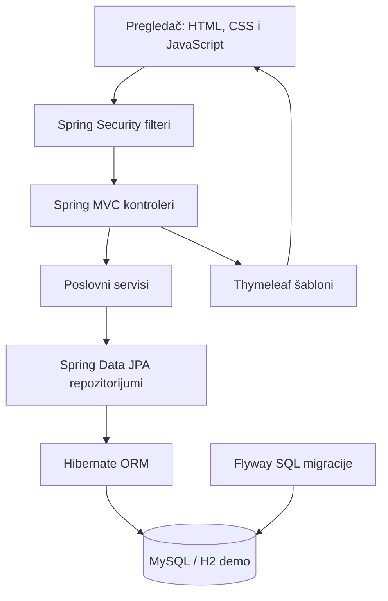
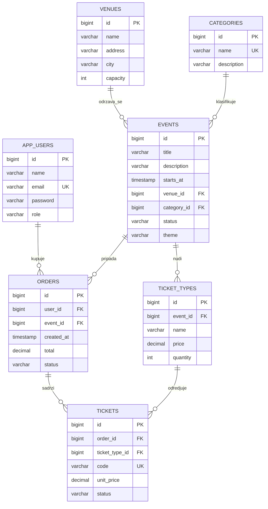
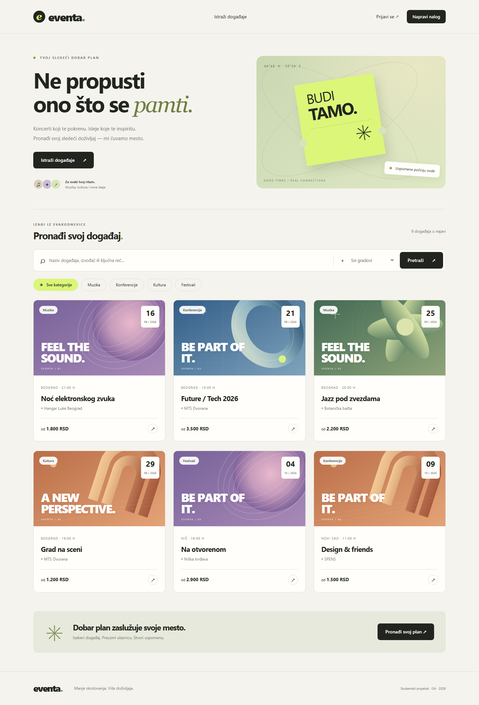
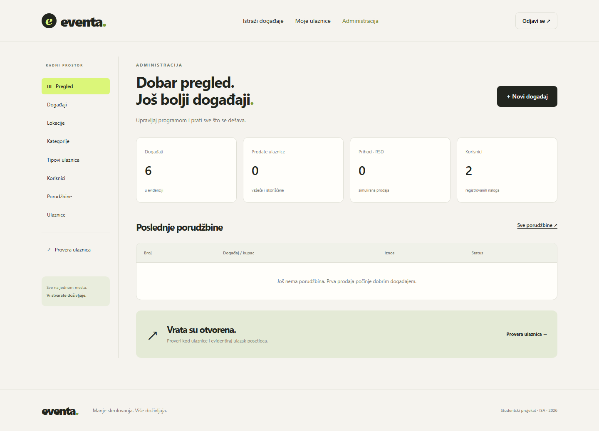
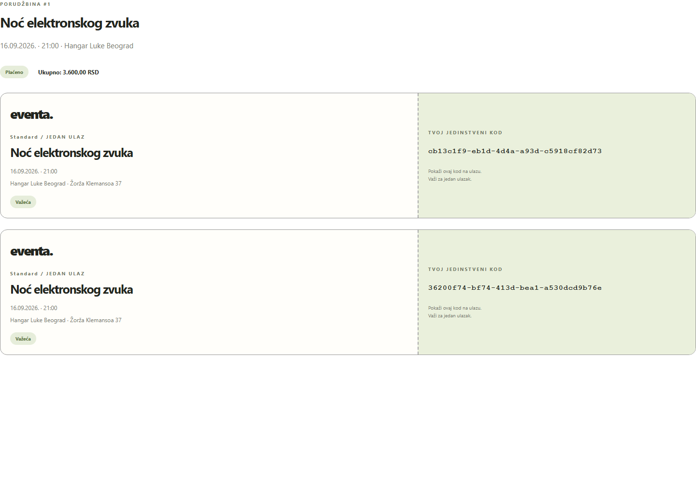

# Projektna dokumentacija

**Predmet:** Internet softverske arhitekture  
**Tema:** Sistem za organizaciju događaja i prodaju ulaznica — Eventa  
**Vrsta realizacije:** Spring MVC aplikacija sa CRUD operacijama i relacionom bazom  
**Autor i broj indeksa:** dopuniti pre predaje  
**Godina:** 2026.

## 1. Cilj i obim

Eventa povezuje pregled ponude događaja sa izdavanjem i kontrolom ulaznica. Posetilac pronalazi događaj, bira tip ulaznice i količinu, potvrđuje simuliranu kupovinu i dobija jedinstvene kodove. Administrator održava program, cene, kapacitete i evidenciju kupovina, a na ulazu proverava kod posetioca.

Projekat realizuje Spring MVC varijantu iz ispitnog uputstva. Ima sedam poslovnih tabela, CRUD za svaku, korisnički interfejs i projektnu dokumentaciju. Aplikacija je slojeviti monolit: jedan proces, jedna baza i serverski generisane HTML stranice. Mikroservisi nisu izabrana varijanta ovog projekta.

Stvarno kartično plaćanje, slanje emaila, numerisana sedišta, povraćaj novca preko banke i skeniranje QR koda kamerom nisu deo obima. Plaćanje se simulira, a kontrola ulaska koristi tekstualni UUID kod.

## 2. Akteri i slučajevi korišćenja

| Akter | Ovlašćenja |
|---|---|
| Neprijavljeni posetilac | Katalog, pretraga, detalji, registracija i prijava |
| Registrovani posetilac | Sve javne funkcije, kupovina, sopstvene porudžbine, štampa i otkazivanje |
| Administrator | Sve navedeno, kontrolna tabla, CRUD svih entiteta, provera ulaza |

### Kupovina ulaznica

**Preduslovi:** korisnik je prijavljen, događaj objavljen i u budućnosti, odabrani tip postoji.

1. Korisnik otvara događaj i bira Standard ili VIP.
2. Aplikacija prikazuje cenu, raspoloživu količinu i napomenu o demo plaćanju.
3. Korisnik bira 1–10 ulaznica i potvrđuje kupovinu.
4. Server zaključava događaj, proverava status, datum i preostalu količinu.
5. Server računa iznos pomoću `BigDecimal`, kreira plaćenu porudžbinu i pojedinačne ulaznice.
6. Korisnik se preusmerava na svoju porudžbinu sa kodovima i opcijom štampe.

**Alternativni tok:** ako više nema mesta, događaj je otkazan ili je količina neispravna, prikazuje se poruka. Transakcija se poništava i delimična porudžbina ne ostaje u bazi.

### Otkazivanje porudžbine

Korisnik može otkazati svoju porudžbinu pre početka događaja ako nijedna njena ulaznica nije iskorišćena. Porudžbina i ulaznice prelaze u `CANCELLED`. Raspoloživa količina se ponovo dobija iz baze i otkazane ulaznice ne zauzimaju mesta. Ponovljeni zahtev za otkazivanje već otkazane porudžbine ne menja stanje.

### Kontrola ulaska

Administrator unosi kod ulaznice. Server zaključava događaj, osvežava stanje ulaznice, proverava važenje porudžbine, događaj i vremenski prozor. Ako je kod važeći, ulaznica prelazi iz `ACTIVE` u `USED`. Drugi zahtev sa istim kodom dobija poruku da je ulaznica već iskorišćena.

### Administratorski CRUD

Administrator pristupa evidenciji, bira novi zapis ili izmenu, popunjava formu i čuva je. Podaci se proveravaju na serveru. Neispravna forma ostaje otvorena sa unetim vrednostima i porukom. Brisanje zahteva potvrdu u pregledaču, dok server proverava relacije i poslovna pravila. Porudžbine i ulaznice stvaraju se preko istog servisa kao kupovina, tako da se količine i iznosi ne mogu zaobići administratorskom formom.

## 3. Arhitektura



| Sloj | Klase / direktorijum | Odgovornost |
|---|---|---|
| Prezentacija | `templates`, `static` | HTML prikaz, stilovi, klijentski obračun pregleda iznosa |
| MVC | `PublicController`, `AdminController`, `ViewAdvice` | HTTP parametri, model, izbor pogleda i preusmeravanje |
| Servisi | `BookingService`, `AdminService`, `AccountService` | Pravila, transakcije, autorizacija vlasništva i izračunavanje |
| Pristup podacima | Sedam `JpaRepository` interfejsa | Upiti, čuvanje, brojanje i zaključavanje |
| Domen | `AppUser`, `Venue`, `Category`, `Event`, `TicketType`, `PurchaseOrder`, `Ticket` | Mapiranje sedam poslovnih tabela |
| Konfiguracija | `SecurityConfig`, `DemoData`, properties | Prijava, dozvole, profili, početni podaci |

Spring ubrizgava zavisnosti konstruktorima. Lombok generiše pristupne metode i konstruktore da se izbegne ponavljanje. Entiteti ne sadrže HTML, kontroleri ne izvršavaju SQL, a transakcione operacije nalaze se u servisima. `AdminService` opisuje polja administracije metapodacima, dok svaku izmenu obrađuje posebno prema tipu entiteta.

MVC model sadrži podatke za prikaz. Thymeleaf obrađuje model u HTML na serveru; pregledač ne pristupa bazi direktno. Posle uspešnog POST zahteva koristi se **Post/Redirect/Get**, da osvežavanje rezultujuće stranice ne ponovi isti formular. To ne predstavlja opštu zaštitu od dva odvojena klika za kupovinu: dva zasebna važeća zahteva mogu kreirati dve kupovine ako ima mesta.

## 4. Model podataka



Sve veze su modelovane pomoću stranih ključeva i JPA `@ManyToOne`. Primarni ključevi su automatski generisani. SQL `CHECK` ograničenja proveravaju dozvoljene statuse, pozitivne kapacitete i nenegativne cene. Jedinstveni indeksi postoje za email, naziv kategorije i kod ulaznice. Dodatni indeksi pomažu pretragu po terminu, korisniku porudžbine i tipu/statusu ulaznice.

`TicketType.quantity` označava ukupno raspoređeni kapacitet tipa, a ne preostalu količinu. Preostalo se računa kao:

```text
preostalo = ukupna količina tipa − broj njegovih ulaznica čiji status nije CANCELLED
```

`Ticket.unitPrice` čuva cenu u trenutku izdavanja. Naknadna promena cene tipa ne menja istorijsku cenu. `PurchaseOrder.total` je zbir istorijskih cena ulaznica u porudžbini; pri fizičkom brisanju pojedinačne neiskorišćene ulaznice iznos se smanjuje, a pri otkazivanju ostaje kao istorijska vrednost. Kada se obriše poslednja ulaznica, porudžbina postaje otkazana.

Zbir količina svih tipova jednog događaja ne sme biti veći od kapaciteta njegove lokacije. Promena lokacije ili njenog kapaciteta takođe prolazi ovu proveru. Postojeći tip ulaznice ne premešta se na drugi događaj.

## 5. Transakcije i konkurentnost

```mermaid
sequenceDiagram
    actor K as Kupac
    participant C as PublicController
    participant S as BookingService
    participant D as Baza
    K->>C: POST /checkout/{typeId}, quantity, CSRF
    C->>S: purchase(email, typeId, quantity)
    S->>D: BEGIN; zaključaj red događaja
    S->>D: Osveži tip i izbroj neotkazane ulaznice
    alt Prodaja dostupna i dovoljno mesta
        S->>D: INSERT porudžbina i ulaznice
        S->>D: COMMIT
        S-->>C: ID porudžbine
        C-->>K: Redirect /orders/{id}
    else Nema mesta ili prodaja zatvorena
        S->>D: ROLLBACK
        S-->>C: BusinessException
        C-->>K: Redirect sa porukom
    end
```

`@Transactional` povezuje proveru količine i izdavanje u atomsku operaciju. `PESSIMISTIC_WRITE` zaključava red događaja do kraja transakcije. Sve izmene inventara i kontrola ulaza koriste isti red za zaključavanje. Drugi zahtev za isti događaj čeka završetak prvog, osvežava stanje i ponovo proverava dostupnost.

Izolacija konekcija je `READ_COMMITTED`. Ona omogućava da brojanje posle čekanja na zaključavanje vidi potvrđene izmene prethodnog zahteva i na MySQL-u. Osvežavanje entiteta (`EntityManager.refresh`) sprečava korišćenje stare vrednosti iz persistence context-a. Pri izmeni raspodele kapaciteta zaključava se i lokacija. Ovaj pristup daje jednostavnu korektnost uz cenu serijalizacije kupovina jednog događaja; primeren je obimu studentskog projekta.

## 6. Bezbednost i validacija

- Prijava koristi Spring Security i sesiju; lozinke se čuvaju kao BCrypt hash.
- Javna registracija uvek pravi ulogu `USER`, bez preuzimanja uloge iz formulara.
- `/admin/**` zahteva `ADMIN`; kupovina i porudžbine zahtevaju prijavu.
- Vlasništvo porudžbine proverava se u servisu, pa promena ID-a u URL-u ne otvara tuđu kupovinu.
- CSRF je uključen. Thymeleaf dodaje token u POST forme. Odjava je POST zahtev.
- HTML tekst se ispisuje kroz `th:text`, koji escapuje sadržaj. Nema proizvoljnog HTML-a iz opisa događaja.
- Repozitorijumski upiti koriste parametre, bez sastavljanja SQL-a od unetih vrednosti.
- Registracija koristi Bean Validation; administracija proverava vrednosti, dužine, relacije, cene i dozvoljene promene statusa u servisu.
- Iznos i kodovi se računaju na serveru. JavaScript obračun služi samo pregledu korisnika.
- Brisanje povezanih zapisa je ograničeno; iskorišćene ulaznice ostaju u evidenciji. Administrator ne može obrisati sopstveni nalog.

Postojeće prijavljene sesije zadržavaju svoja ovlašćenja do sledeće prijave ili isteka sesije; trenutna invalidacija sesija pri administrativnoj izmeni uloge nije implementirana. Demo konfiguracija je namenjena lokalnoj odbrani. Za javno okruženje bili bi potrebni HTTPS, sopstvene tajne, odgovarajući operativni monitoring, audit trag i dodatne zaštite prijave.

## 7. HTTP rute

| Metod | Ruta | Namena | Pristup |
|---|---|---|---|
| GET | `/`, `/events` | Katalog i filteri `q`, `city`, `category` | Svi |
| GET | `/events/{id}` | Detalji događaja | Svi |
| GET/POST | `/register` | Registracija | Svi |
| GET/POST | `/login` | Prijava | Svi |
| POST | `/logout` | Odjava | Prijavljeni |
| GET/POST | `/checkout/{typeId}` | Potvrda i kupovina | Prijavljeni |
| GET | `/orders` | Sopstvene porudžbine | Prijavljeni |
| GET | `/orders/{id}` | Sopstvena porudžbina i ulaznice | Vlasnik |
| POST | `/orders/{id}/cancel` | Otkazivanje | Vlasnik |
| GET | `/admin` | Statistika | Administrator |
| GET | `/admin/{key}` | Čitanje evidencije | Administrator |
| GET | `/admin/{key}/new` | Forma novog zapisa | Administrator |
| GET | `/admin/{key}/{id}/edit` | Forma izmene | Administrator |
| POST | `/admin/{key}/save` | Kreiranje ili izmena | Administrator |
| POST | `/admin/{key}/{id}/delete` | Brisanje | Administrator |
| GET/POST | `/admin/check-in` | Provera i evidencija ulaska | Administrator |

`key` uzima jednu od vrednosti `users`, `venues`, `categories`, `events`, `types`, `orders`, `tickets`. Rute vraćaju HTML i preusmeravanja; projekat ne predstavlja REST API implementaciju.

## 8. Korisnički interfejs







Vizuelni identitet koristi naziv Eventa, svetlu neutralnu pozadinu, tamne akcione elemente i zelene akcente. Katalog koristi kartice sa lokalnim SVG ilustracijama u četiri stila. Detalji događaja odvajaju informacije od izbora ulaznica. Administracija koristi zajedničku navigaciju, tabelarne evidencije i forme. CSS media upiti prilagođavaju raspored telefonu i tabletu. Štampa prikazuje same ulaznice i uklanja navigaciju i dugmad.

Forme imaju oznake polja, vidljiv fokus, server poruke i HTML ograničenja. Funkcionalnosti kupovine, filtriranja i administracije rade bez JavaScript-a; JavaScript dodaje pregled iznosa, pretragu učitane administratorske tabele, potvrdu brisanja, kopiranje i štampu. Administratorske evidencije se trenutno učitavaju cele, bez serverske paginacije.

## 9. Pokretanje, testiranje i ograničenja

Detaljne komande nalaze se u `README.md`. Profil `demo` koristi H2 bazu u fajlu; profil `mysql` koristi MySQL i parametre okruženja. Docker Compose pokreće bazu i aplikaciju. Test profil koristi odvojenu bazu i fiksni sat. Komanda `mvnw.cmd verify` izvršava testove i pravi izvršivi JAR.

Test scenariji i stvarni rezultati navedeni su u `docs/TESTIRANJE.md`. Testovi obuhvataju ispravne i neispravne zahteve, poslovna pravila, čitanje svih prikaza i dve konkurentne operacije. Ovo nisu testovi velikog opterećenja, niti potpuni bezbednosni audit.

Dalji razvoj mogao bi dodati paginaciju, audit evidenciju, posebnu ulogu kontrolora ulaza, QR prikaz, numerisana sedišta, idempotentnost kupovine i integraciju platnog servisa. Sadašnja realizacija pokriva dogovorene funkcije studentskog projekta.

## 10. Literatura

- [Spring Boot dokumentacija i sistemski zahtevi](https://docs.spring.io/spring-boot/3.5/system-requirements.html)
- [Spring MVC dokumentacija](https://docs.spring.io/spring-framework/reference/web/webmvc.html)
- [Spring Security dokumentacija](https://docs.spring.io/spring-security/reference/index.html)
- [Spring Data JPA dokumentacija](https://docs.spring.io/spring-data/jpa/reference/)
- [Thymeleaf dokumentacija](https://www.thymeleaf.org/documentation.html)
- [MySQL 8.4 Reference Manual](https://dev.mysql.com/doc/refman/8.4/en/)
